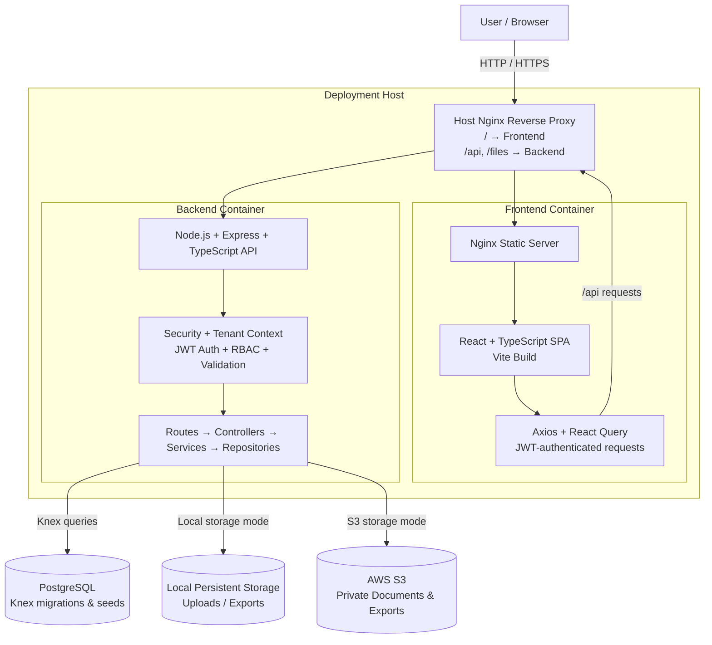

# FEDERA — Sports Federation Management Platform

FEDERA is a full-stack sports management platform designed to centralize the administrative and competitive operations of sports federations and their affiliated associations.

The system was originally commissioned in response to the operational needs of a sports federation. I independently translated those requirements into the product's functional design, system architecture, relational database model, user experience, and technical implementation.

> **Note:** The production source code is maintained in a private repository. This public repository documents the project's architecture, technical decisions, development process, and product functionality without exposing proprietary code, credentials, or sensitive information.

---

## The Problem

Sports federations manage information distributed across associations, athletes, coaches, referees, technical and multidisciplinary staff, competitions, registrations, documentation, payments, and results.

In the original workflow, much of this information had to be collected and consolidated manually.

Competition preparation presented an additional challenge: registration information needed to be reorganized and transferred into Arena, the software used during competitions, creating repetitive administrative work and duplicate data entry.

The federation also needed a centralized way to understand the complete composition of its affiliated associations and maintain current organizational, competitive, and documentary information.

FEDERA was designed to transform these fragmented processes into a structured federation-wide information system.

---

## The Solution

FEDERA centralizes federation operations while distributing responsibility for maintaining information across the organizational structure.

Association Presidents manage the athletes, coaches, referees, delegates, medical personnel, physiotherapists, nutritionists, psychologists, technical staff, and other members belonging to their association.

Federation Administrators maintain federation-wide visibility and control, including association management, competitions, registrations, documentation, results, administrative status, and organizational information.

Competition workflows reuse information already stored in the system, reducing repeated data entry and allowing structured information to move from association records into competition registration and export processes.

This creates a centralized relational information base that supports both day-to-day administration and broader federation-level planning.

---

## Core Features

### Federation & Association Management

- Centralized management of affiliated associations.
- Federation-level and association-level data scopes.
- Association activation and deactivation without deleting historical information.
- Tenant-specific federation configuration and branding.

### People & Organizational Records

Structured records for:

- Athletes
- Coaches
- Referees
- Delegates
- Medical personnel
- Physiotherapists
- Nutritionists
- Psychologists
- Technical and multidisciplinary staff

Athlete records include competitive classification information used throughout registration workflows.

### Competition Management

- Competition creation and configuration.
- Athlete registration using existing federation records.
- Styles, categories, weight divisions, and competition-related classifications.
- Delegation and registration management.
- Registration fee calculation by association.
- Competition result management and historical athlete results.

### Documents

- Centralized document management.
- Document expiration dates.
- Federation validation and rejection workflows.
- Controlled document access and storage.
- Document metadata and integrity handling.

### Data Export

FEDERA generates structured XLSX outputs for different operational requirements:

- Registration and payment-control reports.
- Arena-compatible competition exports.
- International competition registration formats.
- Federation-wide and association-specific exports.

The Arena workflow generates compatible registration files rather than using a direct Arena API integration.

### Access Control

The system implements role-based access and organizational data scoping for:

- Super Administrator
- Federation Administrator
- Association President

Federation Administrators operate within federation-level scope, while Association Presidents are restricted to their own association and its corresponding workflows.

---

## System Architecture

FEDERA uses a containerized web architecture with a React frontend, a TypeScript/Express backend, PostgreSQL for relational data, and configurable local or AWS S3 storage.

The frontend and backend run in separate Docker containers. PostgreSQL is external to the Docker Compose configuration, while file storage can operate either through persistent local storage or AWS S3 depending on the deployment configuration.

The backend follows a modular layered architecture:

`Routes → Controllers → Services → Repositories → PostgreSQL`

Tenant isolation is primarily enforced at the application level through federation- and association-aware middleware, authorization rules, and relational data scoping.

---

## Tech Stack

### Frontend

- React
- TypeScript
- Vite
- Tailwind CSS
- Radix UI
- Axios
- TanStack React Query
- React Hook Form
- Zod

### Backend

- Node.js
- Express
- TypeScript
- REST APIs
- Zod

### Data

- PostgreSQL
- Knex
- SQL migrations
- Environment-specific seeds

### Infrastructure & Storage

- Docker
- Docker Compose
- Nginx
- AWS EC2
- AWS RDS
- AWS S3
- Local persistent file storage

### Reports & Files

- ExcelJS
- pdf-lib

### Testing & Development

- Jest
- Supertest
- ESLint
- Prettier
- Husky
- GitHub Actions
- Dependabot
- Secret scanning

---

## Technical Highlights

- Designed a shared-database multi-tenant architecture with federation- and association-level data scoping.
- Implemented role-based access control across Super Administrator, Federation Administrator, and Association President workflows.
- Built a modular TypeScript REST backend using route, controller, service, and repository layers.
- Designed a relational PostgreSQL schema managed through versioned Knex migrations and environment-specific seeds.
- Implemented JWT authentication with access and refresh tokens, server-side sessions, and session invalidation.
- Built configurable XLSX export pipelines for Arena-compatible, international, federation-wide, and association-specific workflows.
- Implemented document validation, expiration handling, controlled access, metadata management, and file integrity mechanisms.
- Supported both local persistent file storage and private AWS S3 storage with controlled access.
- Created separate Docker-based staging and production configurations.
- Developed automated backend tests covering authentication, authorization, tenant scoping, documents, exports, and competition workflows.
- Implemented deployment infrastructure using AWS EC2, RDS, and S3 during the project's deployed development stage.

---

## Project Scope

The first fully validated implementation supports a single federation with multiple affiliated associations.

Within this scope, the Federation Administrator and Association President workflows are implemented and tested.

The architecture was designed to support multiple federations through tenant-level data separation and a Super Administrator role. Elements of this functionality are implemented, but the complete multi-federation workflow requires additional development and validation before being considered production-ready.

Several additional domain modules were also explored or structurally prepared during development but are not presented as completed functionality in this portfolio.

---

## Current Limitations & Future Development

Potential next development steps include:

- Complete validation of multi-federation workflows.
- Direct import of competition results from Arena.
- Further development and validation of Super Administrator workflows.
- Expansion of analytics and federation-level reporting.
- Additional automated frontend testing.
- Further CI/CD automation.

---

## Product Preview

Selected screenshots and interface designs will document the main product workflows, including:

- Federation administration
- Association management
- Athlete and staff records
- Competition creation
- Competition registration
- Document workflows
- Results management
- Data exports

---

## Documentation

Additional technical documentation is organized under `/docs`, including:

- System architecture
- Database design
- Competition workflow
- Technical decisions and implementation notes

---

## Development

FEDERA was independently designed and developed from the original operational requirements provided by the client.

My responsibilities included:

- Requirements analysis
- Product and workflow design
- UI/UX design
- System architecture
- Relational database design
- Frontend development
- Backend development
- API design
- Authentication and authorization
- Cloud infrastructure configuration
- Testing
- Technical documentation

Development began in September 2025. The validated implementation was completed in early 2026, and the project remains available for continued technical development and improvement.
