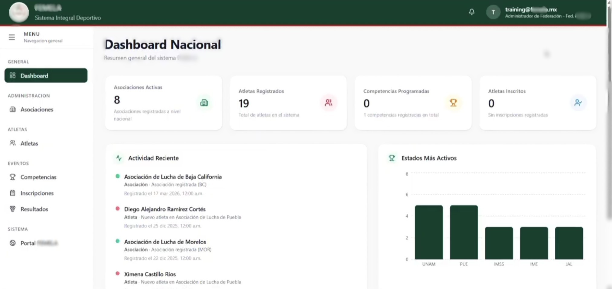
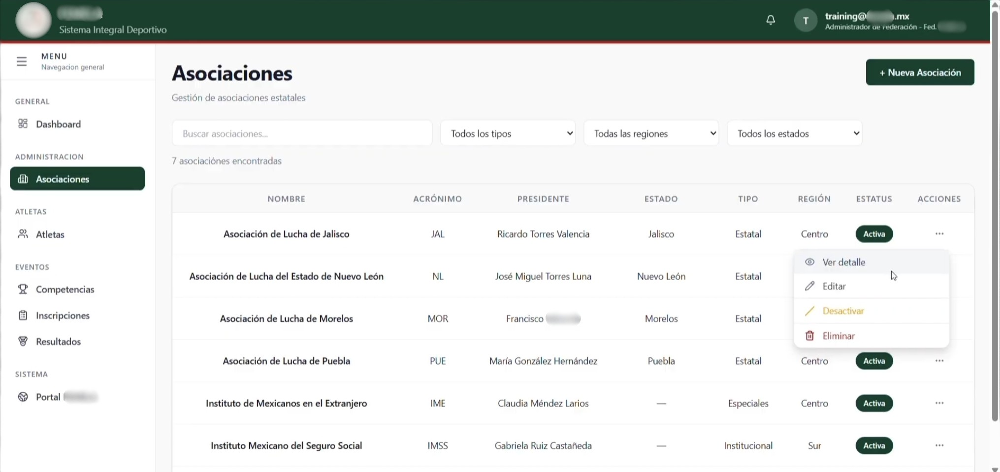
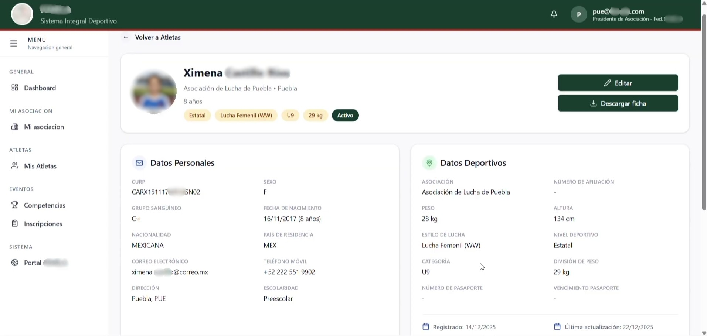
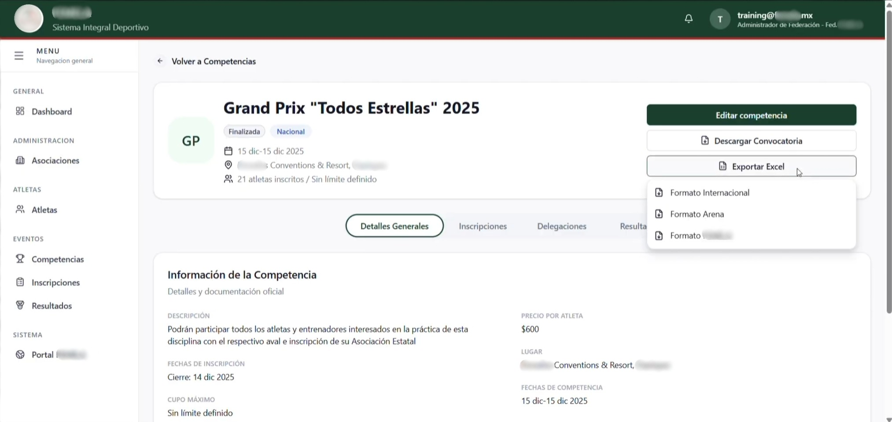
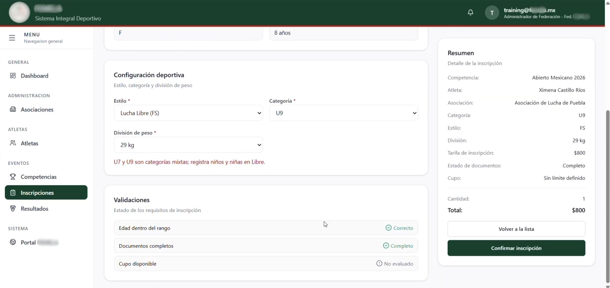
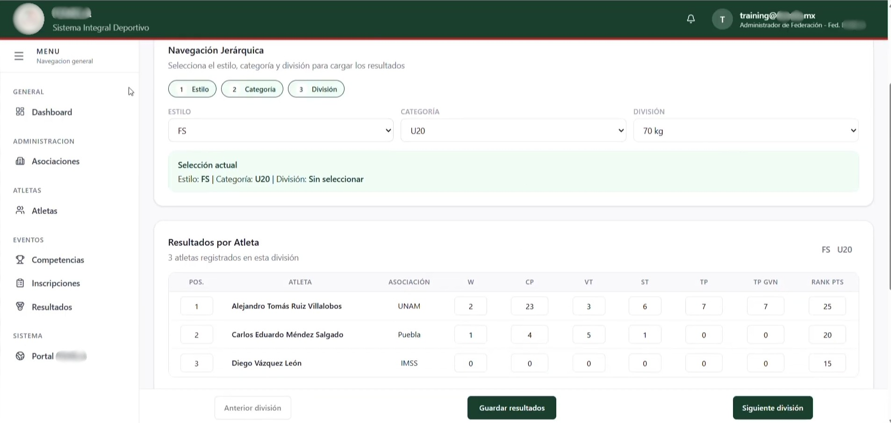
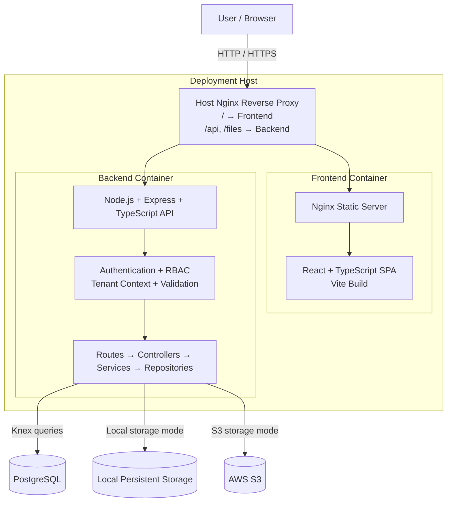

# FEDERA — Sports Federation Management Platform

FEDERA is a full-stack sports management platform designed to centralize the administrative and competitive operations of sports federations and their affiliated associations.

The system was originally commissioned in response to the operational needs of a sports federation. I independently translated those requirements into the product's functional design, system architecture, relational database model, user experience, and technical implementation.

> **Note:** The full source code is maintained in a private repository. This public repository documents the project's architecture, database design, development process, and product functionality without exposing proprietary code, credentials, or sensitive information.

---

## The Problem

Sports federations manage information across associations, athletes, coaches, referees, technical and multidisciplinary staff, competitions, registrations, documentation, payments, and results.

In the original workflow, much of this information had to be collected and consolidated manually.

Competition preparation presented an additional challenge: registration information needed to be reorganized and transferred into Arena, the software used during competitions, creating repetitive administrative work and duplicate data entry.

The federation also needed a centralized way to understand the composition of its affiliated associations and maintain current organizational, competitive, and documentary information.

FEDERA was designed to transform these fragmented processes into a structured federation-wide information system.

---

## The Solution

FEDERA centralizes federation operations while distributing responsibility for maintaining information across the organizational structure.

**Federation Administrators** maintain federation-wide visibility and control over associations, athletes, competitions, registrations, documents, results, and administrative status.

**Association Presidents** manage the athletes and personnel belonging to their own association and register eligible athletes for competitions.

Information already stored in the system is reused throughout competition workflows, reducing duplicate data entry and allowing structured information to move from athlete records into registrations, delegations, results, and exports.

This creates a centralized relational information base for both day-to-day administration and broader federation-level oversight.

---

## Core Workflows

### Federation & Association Management

Federation Administrators can manage affiliated associations and maintain federation-wide visibility over their organizational information.

Associations can be activated or deactivated without deleting their historical records, allowing administrative status to be controlled while preserving the underlying data.

Role-based and organizational data scopes determine which information and actions are available to federation- and association-level users.

### Athlete & Organizational Records

FEDERA maintains structured records for athletes and other members of the sports organization, including coaches, referees, delegates, medical personnel, physiotherapists, nutritionists, psychologists, and technical or multidisciplinary staff.

Athlete profiles combine personal and competitive information such as association, wrestling style, age category, competitive level, and weight division.

These records are reused across competition registration and result workflows.

### Competition Management & Data Export

Federation Administrators can create and configure competitions using styles, age categories, weight divisions, registration periods, fees, and other competition-specific parameters.

Competition information can be exported into structured XLSX formats for different operational requirements, including:

- Registration and payment-control reports
- Arena-compatible competition files
- International competition registration formats
- Federation-wide and association-specific exports

The Arena workflow generates compatible files rather than using a direct Arena API integration.

### Registration Workflow

Association Presidents register athletes using information already stored in their association records.

The registration workflow uses competition configuration and athlete information to validate relevant requirements and classifications before registration.

This allows existing federation data to be reused instead of repeatedly entering athlete information for each competition.

Registrations can then be reviewed at federation level and used to organize delegations and calculate registration fees by association.

### Results Management

FEDERA supports structured competition result capture using the competition hierarchy of wrestling style, age category, and weight division.

Administrators can record athlete results and competition metrics within the corresponding division. Results become part of the system's competitive records and can later be consulted through federation- and association-level workflows.

### Documents & Administrative Control

The system also supports:

- Centralized document management
- Document expiration dates
- Federation validation and rejection workflows
- Controlled document access and storage
- Document metadata and integrity handling
- Association administrative status control
- Historical athlete results
- Federation-wide and association-specific data scopes

---

## System Architecture

FEDERA uses a containerized web architecture with a React frontend, a TypeScript/Express backend, PostgreSQL for relational data, and configurable local or AWS S3 file storage.

The frontend and backend run in separate Docker containers.

The backend follows a modular layered architecture:

`Routes → Controllers → Services → Repositories → PostgreSQL`

PostgreSQL is external to the Docker Compose configuration, while file storage can operate through either persistent local storage or private AWS S3 depending on the deployment configuration.

Federation- and association-level data access is primarily enforced at the application level through tenant-aware middleware, authorization rules, and relational data scoping.

---

## Tech Stack

| Area | Technologies |
| --- | --- |
| **Frontend** | React, TypeScript, Vite, Tailwind CSS, Radix UI |
| **Backend** | Node.js, Express, TypeScript, REST APIs, Zod |
| **Data** | PostgreSQL, Knex, SQL migrations and seeds |
| **Infrastructure** | Docker, Docker Compose, Nginx, AWS EC2, RDS, S3 |
| **Files & Reports** | ExcelJS, pdf-lib |
| **Testing & Development** | Jest, Supertest, GitHub Actions, ESLint, Prettier, Husky |

---

## Technical Highlights

- Designed a relational PostgreSQL data model for federation, association, athlete, competition, registration, document, and result workflows.
- Implemented federation- and association-level data scoping within a shared-database architecture.
- Implemented role-based access control for Federation Administrator and Association President workflows, with a partially implemented Super Administrator layer.
- Built a modular TypeScript REST backend using route, controller, service, and repository layers.
- Implemented JWT authentication with access and refresh tokens and server-side session management.
- Built XLSX export pipelines for Arena-compatible, international, federation-wide, and association-specific workflows.
- Implemented document validation, expiration handling, metadata management, and controlled storage.
- Supported both local persistent file storage and private AWS S3 storage.
- Created separate Docker-based staging and production configurations.
- Developed automated backend tests covering authentication, authorization, tenant scoping, documents, exports, and competition workflows.
- Deployed the system using AWS EC2, RDS, and S3 during the project's deployed development stage.

---

## Project Scope

The fully validated implementation supports one federation with multiple affiliated associations.

Within this scope, the **Federation Administrator** and **Association President** workflows were implemented and tested.

The architecture was also designed to support multiple federations through tenant-level data separation and a **Super Administrator** role. Elements of this functionality were implemented, but the complete multi-federation workflow requires additional development and validation before being considered production-ready.

Several additional domain modules were explored or structurally prepared during development but are not presented as completed functionality in this portfolio.

---

## Current Limitations & Future Development

Potential next development steps include:

- Complete validation of multi-federation workflows
- Direct import of competition results from Arena
- Further development and validation of Super Administrator workflows
- Expansion of federation-level analytics and reporting
- Additional automated frontend testing
- Further CI/CD automation

---

## Database Design

FEDERA uses a relational PostgreSQL model designed around the organizational and competitive structure of a sports federation.

The database connects federation and association records with athletes, organizational personnel, competitions, registrations, documents, delegations, and competitive results.

A detailed explanation of the relational model, entity relationships, data scoping, and key database design decisions is available here:

[View Database Design](docs/database-design.md)

---

## My Role

FEDERA was independently designed and developed from the original operational requirements provided by the client.

My responsibilities included:

- Requirements analysis
- Product and workflow design
- UI/UX design
- System architecture
- Relational database design
- Frontend development
- Backend development
- API design
- Authentication and authorization
- Cloud infrastructure configuration
- Testing
- Technical documentation

Development began in September 2025. The validated implementation was completed in early 2026, and the project remains available for continued technical development and improvement.
