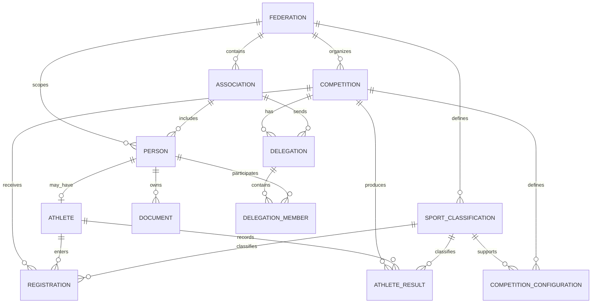

# FEDERA — Database Design

FEDERA uses a relational PostgreSQL data model designed around the organizational and competitive structure of a sports federation.

The database supports federation and association management, reusable athlete and personnel records, competition configuration, registrations, delegations, documents, results, authentication, and structured data exports.

PostgreSQL is used as the relational database engine, with Knex managing schema migrations and database access within the application.

> **Portfolio scope note:** This document presents a high-level, domain-oriented view of FEDERA's database architecture for portfolio purposes. The production schema contains additional supporting tables, catalogs, configuration entities, audit records, authentication structures, export-history records, constraints, indexes, and other implementation details that are intentionally omitted here. The ER diagram therefore represents the principal business domains and relationships rather than the complete physical database schema.

---

## Design Overview

FEDERA follows a shared-database architecture in which a federation represents the primary organizational scope.

Federation-owned information includes associations, competitions, sporting classifications, people, documents, and other operational records.

Association-level information is connected to the federation structure while allowing each association to manage its own athletes and personnel.

Some entities store federation or association scope directly, while others inherit that context through their relationships with parent entities.

Tenant isolation is primarily enforced by the application's authorization and data-access layers rather than through PostgreSQL Row Level Security.

At a high level, the data model can be understood through six connected domains:

1. Federation & Associations
2. People & Sporting Profiles
3. Competition Configuration
4. Registrations & Delegations
5. Results
6. Documents & Access Control

---

## Core Data Model

### Federation & Associations

The federation is the organizational root of the system.

A federation can manage multiple affiliated associations while maintaining centralized visibility over their organizational and competitive information.

At this level, the model supports relationships between:

- Federations
- Associations
- Federation-specific sporting classifications
- Competitions
- People and organizational records

Associations maintain their own operational information while remaining connected to the federation-wide data structure.

This allows the federation to maintain centralized oversight without requiring every record to be managed directly by federation administrators.

---

### People & Sporting Profiles

FEDERA separates a person's common identity information from role-specific information.

A shared person record stores the information common to individuals in the system, while specialized records represent sporting or professional roles such as:

- Athletes
- Coaches
- Referees
- Delegates
- Medical personnel
- Physiotherapists
- Nutritionists
- Psychologists
- Other technical or multidisciplinary personnel

This structure reduces duplication of personal information while allowing each role to maintain its own domain-specific attributes.

Athletes additionally contain sporting information used throughout the system, including competitive classification and other athlete-specific attributes.

Because athlete records are reusable, the same information can participate in registration, delegation, document, and result workflows without being recreated for every competition.

---

### Sporting Classification

FEDERA represents sporting classifications as structured relational data rather than repeated free-text values.

The main concepts include:

- Wrestling styles
- Age categories
- Weight divisions
- Sex classifications

Styles and categories can be defined within the federation's organizational scope.

Weight divisions connect the relevant sporting classification dimensions so that athletes, competition configurations, registrations, and results can reference consistent data.

This provides a common classification structure across the competitive workflow.

---

### Competitions & Configuration

Competitions belong to the federation and contain the information required to manage an event.

The model supports concepts such as:

- Competition dates
- Location
- Competition type and status
- Registration periods
- Athlete limits
- Registration fees
- Competition documentation
- Enabled wrestling styles
- Enabled category and style combinations

Rather than storing all competition configuration directly in a single record, related configuration entities allow each competition to define the sporting combinations available for participation.

This provides flexibility while preserving the relationship between competition configuration and the federation's reusable sporting classifications.

---

### Registrations & Delegations

Registrations connect athletes with competitions.

A registration references the athlete and the relevant competitive classification for that event, allowing the system to reuse information already stored in the athlete and competition records.

Registration workflows can also maintain operational states such as:

- Registration status
- Document verification
- Medical clearance
- Payment confirmation
- Cancellation state
- Registered weight

Delegations represent the group sent by an association to a particular competition.

A delegation belongs to an association and a competition and can contain both athletes and staff members.

Registrations and delegations participate in the same broader competition workflow, but they are modeled as separate concepts rather than through a direct registration-to-delegation relationship.

This separation allows registrations to represent competitive participation while delegations represent the organizational group attending the event.

---

### Results

FEDERA stores competitive results as part of the same relational structure used for competitions and athletes.

At a high level, result information connects:

- Competitions
- Athletes
- Associations
- Sporting classifications
- Ranking and competition statistics

This allows competitive outcomes to become part of an athlete's historical record instead of remaining isolated within individual competition files.

The model also supports competition-level result information and individual athlete-level outcomes.

---

### Documents

Documents are associated with people and can participate in federation and association workflows.

The document model supports concepts such as:

- Document types
- Document status
- Issue and expiration dates
- Validation and rejection
- Storage metadata
- Document requirements
- Controlled access

Document requirements can vary according to contextual criteria, allowing the system to determine which documentation is relevant for different types of participants.

The underlying implementation also maintains supporting information for document lifecycle and access auditing, although those auxiliary structures are intentionally omitted from the portfolio-level ER diagram.

---

### Authentication & Authorization

FEDERA uses role-based access control to support different levels of system access.

At a conceptual level, the authorization model connects:

- Users
- Roles
- Permissions
- Organizational scope
- User sessions

This supports federation-level and association-level workflows while allowing the application to determine which operations and records are available to each authenticated user.

Authentication and authorization contain additional implementation-level structures that are not represented in the simplified domain ER diagram.

---

### Data Exports

Structured exports reuse information already stored across the relational model.

Depending on the export workflow, data can be assembled from:

- Competitions
- Registrations
- Athletes
- Associations
- Sporting classifications
- Registration status information

FEDERA supports export workflows for Arena-compatible competition files, international registration formats, federation-level information, and association-level information.

Export execution and history are supported by additional persistence structures in the full schema but are omitted from the high-level model below.

---

## High-Level Entity Relationship Diagram

The following ER diagram intentionally represents the principal business entities and relationships only.

It is **not a complete representation of every physical table in the FEDERA database**. Supporting catalogs, authentication tables, configuration entities, audit records, export-history structures, status tables, and other implementation-specific entities have been omitted to keep the model readable and focused on the system's core domains.

The diagram abstracts several related physical tables into domain concepts.

For example, `SPORT_CLASSIFICATION` represents the group of relational structures used for styles, categories, weight divisions, and related classification data. Likewise, authentication, export history, document configuration, status catalogs, and other supporting structures remain part of the full database even though they are not displayed here.

---

## Key Design Decisions

### 1. Centralized Person Model

Common identity information is separated from role-specific sporting and professional information.

This allows athletes and other personnel types to reuse a common person record while maintaining specialized attributes where necessary.

The approach reduces duplication and creates a consistent identity layer across organizational, document, delegation, and competition workflows.

---

### 2. Relational Sporting Classifications

Styles, categories, and weight divisions are modeled as structured relational concepts rather than repeated text fields.

This allows the same classifications to be reused across:

- Athlete profiles
- Competition configuration
- Registrations
- Results
- Data exports

The result is a more consistent competitive data model and less duplicated classification information.

---

### 3. Reusable Data Across Workflows

A central design objective of FEDERA was to avoid repeatedly entering information that already existed elsewhere in the system.

Athlete, association, classification, and competition information can therefore participate in multiple workflows.

Conceptually:

`Athlete Record → Registration → Competition → Results → Historical Record`

The same relational information can also feed delegation and export processes.

---

### 4. Organizational Data Scoping

The data model represents federation and association scope throughout the organizational hierarchy.

Some entities contain this scope directly, while others inherit it through relationships with federation- or association-owned records.

The application combines this relational structure with authorization logic to control access to federation-level and association-level information.

The current implementation should therefore be described as **application-enforced tenant isolation**, not as PostgreSQL Row Level Security.

---

### 5. Separation of Registration and Delegation Concepts

Competitive registration and organizational delegation membership represent different business concepts.

A registration describes an athlete's participation in a competition and competitive classification.

A delegation represents the group of athletes and staff sent by an association to that competition.

Keeping these concepts separate allows each workflow to evolve independently while remaining connected through the broader competition and association context.

---

### 6. Historical and Operational State

FEDERA uses explicit status and active-state concepts throughout the system rather than treating every operational change as record deletion.

This allows historical information to remain available while supporting workflows such as:

- Association activation and deactivation
- Registration validation or cancellation
- Document validation and expiration
- Result publication
- Session revocation

This was particularly important for maintaining continuity in federation and athlete records over time.

---

### 7. Database and Application Responsibilities

The relational model provides structural integrity through relationships, constraints, and schema-level validation.

The application layer adds domain-specific authorization, tenant context, workflow validation, and cross-entity business rules.

This separation allows the database to preserve relational consistency while the API enforces rules that depend on the authenticated user and operational context.

---

## Database Technology

The database layer is built with:

| Component | Technology |
| --- | --- |
| Relational database | PostgreSQL |
| Query & migration layer | Knex |
| Backend integration | Node.js / TypeScript |
| Schema evolution | Versioned migrations |
| Environment initialization | Environment-specific seeds |

The complete implementation also uses PostgreSQL-specific capabilities and database-level integrity mechanisms where appropriate.

Detailed migration definitions, indexes, internal constraints, triggers, configuration tables, and other low-level implementation details are intentionally kept in the private source repository.

---

## Scope & Limitations

This document describes the database architecture at a portfolio level rather than serving as complete database documentation.

The validated implementation was developed around one federation with multiple affiliated associations.

The broader architecture includes federation-level tenant structures intended to support multiple federations, but the complete multi-federation workflow has not been fully validated.

Other relevant boundaries include:

- Tenant isolation is primarily enforced through the application layer; PostgreSQL Row Level Security is not presented as an implemented feature.
- Not every tenant relationship is represented through a direct database-level scope field; some records inherit organizational context through related entities.
- Registrations and delegations are separate concepts and do not have a direct foreign-key relationship.
- The model stores competition fees and registration payment-confirmation information but is not a payment-processing or accounting system.
- File and document storage evolved during development, and the schema supports metadata associated with different storage approaches.
- This portfolio document represents the intended schema reflected in the private repository rather than exposing a live database or complete production schema.

---

## Why This Design

FEDERA's database was designed to create a reusable relational information base for sports federation operations.

Instead of treating associations, athletes, competitions, registrations, documents, delegations, and results as isolated datasets, the system connects them through shared organizational and competitive relationships.

This allows information entered once to support multiple workflows while preserving historical records and federation-level visibility.

The complete schema contains additional implementation and support structures beyond those presented here; this document intentionally focuses on the relationships that best explain the system's domain architecture.
